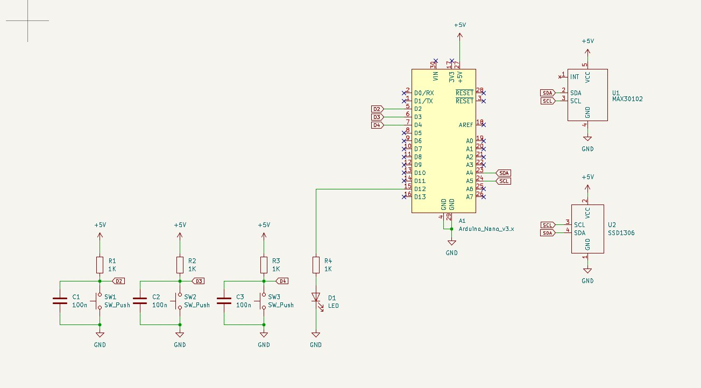
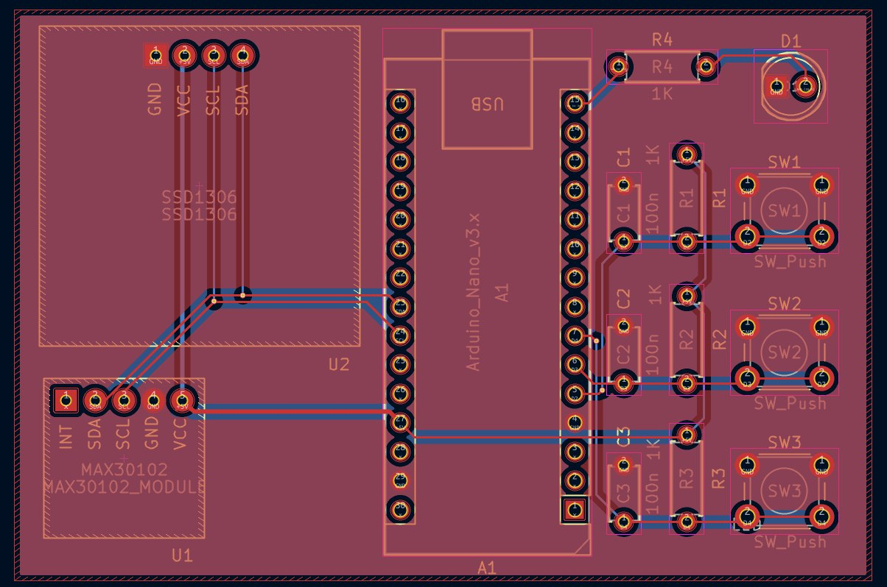
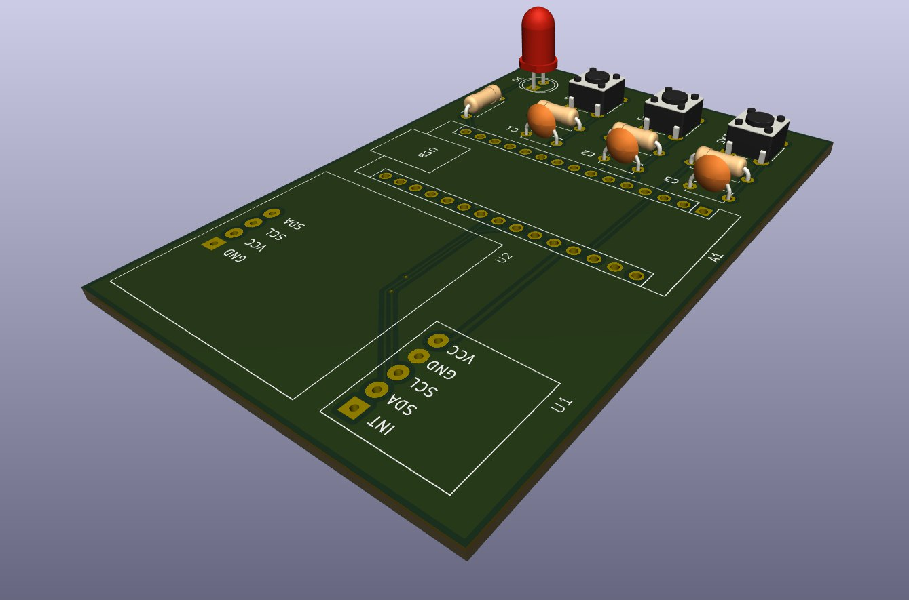
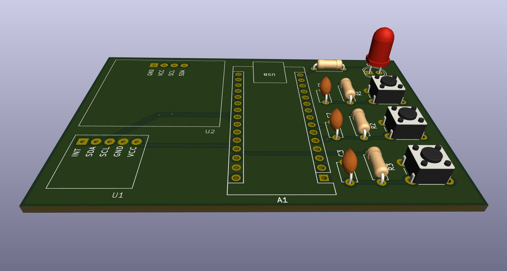

# Monitor Biométrico Portátil con Arduino Nano y MAX30102

Este repositorio contiene los archivos de diseño de **KiCad 9.0** para un dispositivo electrónico que integra un sensor biomédico **MAX30102**, una pantalla **OLED SSD1306** y un **Arduino Nano**. El objetivo principal del proyecto es ofrecer una plataforma de hardware de código abierto para el monitoreo de la frecuencia cardíaca y el nivel de oxígeno en sangre (**SpO₂**). Es perfecto para estudiantes, desarrolladores y aficionados que deseen explorar la electrónica biomédica y la creación de dispositivos *wearables*.

## 📝 Descripción del Proyecto

La tarjeta electrónica está diseñada para ser compacta y funcional. Utiliza la comunicación **I2C** para que el Arduino Nano pueda interactuar con el sensor MAX30102 y la pantalla OLED de manera eficiente. El sistema es capaz de leer datos biométricos en tiempo real y mostrarlos de forma clara y sencilla en la pantalla, lo que lo convierte en una excelente base para proyectos de salud portátiles o educativos.

### Características Clave

* **Diseño Compacto:** Optimizado para la integración de los módulos principales.
* **Comunicación I2C:** Interfaz eficiente para la conexión de los módulos.
* **Medición de SpO₂ y Frecuencia Cardíaca:** Usa el sensor **MAX30102** para lecturas precisas.
* **Visualización en Pantalla:** Pantalla **OLED SSD1306** para una visualización clara.
* **Plataforma de Control:** **Arduino Nano** como cerebro del proyecto.
* **Código Abierto:** El diseño es fácil de adaptar y modificar.

---

## ⚙️ Lista de Componentes

A continuación, se detalla la lista de todos los componentes necesarios para ensamblar el dispositivo.

| Reference | Qty | Value                 | Footprint                                  |
| :-------- | :-: | :-------------------- | :----------------------------------------- |
| A1        | 1   | Arduino_Nano_v3.x     | Module:Arduino_Nano                        |
| C1,C2,C3  | 3   | 100n                  | Capacitor_THT:C_Disc_D4.7mm_W2.5mm_P5.00mm |
| D1        | 1   | LED                   | LED_THT:LED_D5.0mm                         |
| R1,R2,R3,R4 | 4 | 1K                    | Resistor_THT:R_Axial_DIN0207_L6.3mm_D2.5mm_P7.62mm_Horizontal |
| SW1,SW2,SW3 | 3 | SW_Push               | Button_Switch_THT:SW_PUSH_6mm              |
| U1        | 1   | MAX30102              | spo2_stuff:MAX30102_MODULE                 |
| U2        | 1   | SSD1306               | spo2_stuff:SSD1306                         |

---

## 📸 Imágenes del Proyecto

### 1. Esquema Eléctrico

### 2. PCB

### 3. Vista Ortogonal

### 4. Vista Superior

---

## 🚀 Cómo usar este repositorio

1.  **Clona el repositorio:** `git clone https://github.com/ingwplanchez/kicad-biosense-nano.git`
2.  **Abre el proyecto en KiCad:** Navega a la carpeta del proyecto y abre el archivo `.kicad_pro`.
3.  **Visualiza y modifica:** Explora el esquemático y el diseño de la PCB. Si lo deseas, puedes generar los archivos Gerber para fabricar tu propia placa.